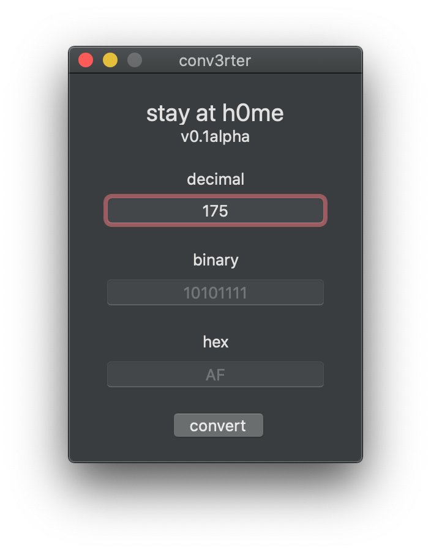
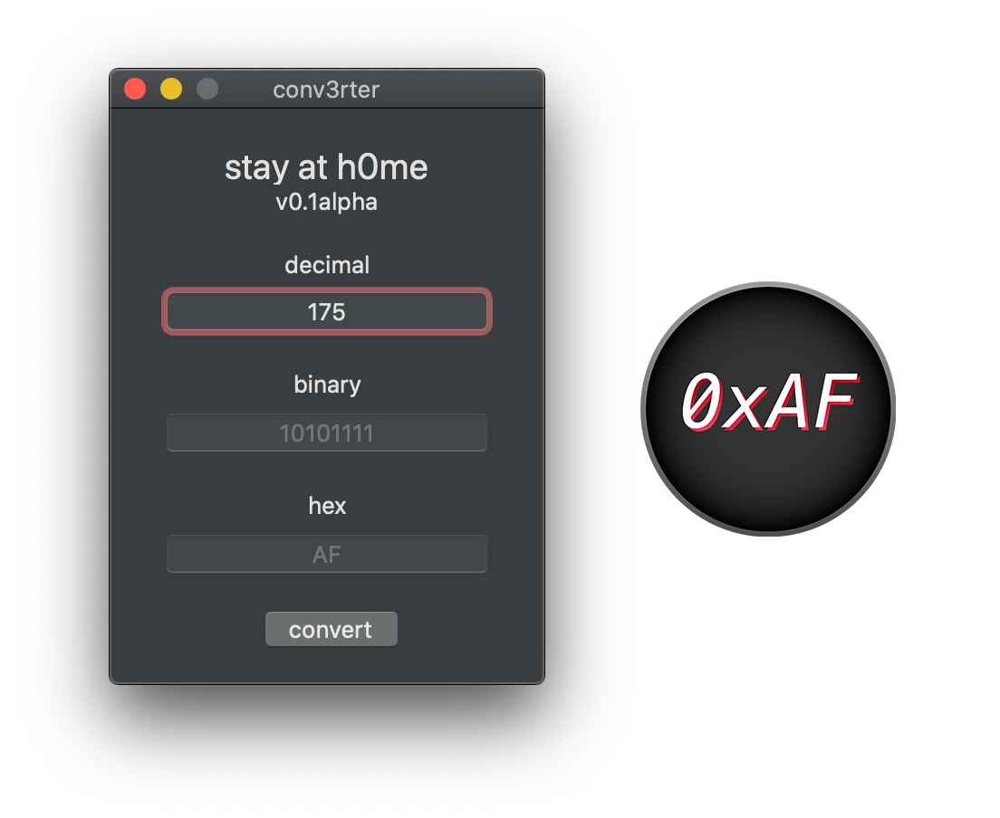

# conv3rter
A simple Mac application to convert between decimal, binary, and hex.

<!--  -->


## Download conv3rter

Download a precompiled version of conv3rter <a href="production/conv3rter0.2alpha/conv3rter0.2alpha.dmg" download>here!</a>

## Building from Source

These instructions will get you a copy of the project up and running
on your local machine. This is usually just for development and testing,
but we have no deployment strategies, so have at it.

#### Prerequisites

To use conv3rter you will need:

- A Mac with macOS 10.11+
- Xcode 10.1+

#### Installation

Clone to your home directory or checkout with SVN to get a copy of conv3rter.

```bash
git clone https://github.com/zhooda/conv3rter.git
```

To builld, open the Xcode project and build for archive (or just press run if you want to debug). I'll probably add the precompiled binary later on but for now its just an Xcode project and some code.

**NOTE:** At the moment, only the decimal text field works to actually convert any values. The other text fields will be enabled and working in v0.2alpha.

## Contributing
Pull requests are welcome. For major changes, please open an issue first to discuss what you would like to change, but really, this project was written in a hurry so definitely open some pull requests :)

## License
[MIT](https://choosealicense.com/licenses/mit/)
